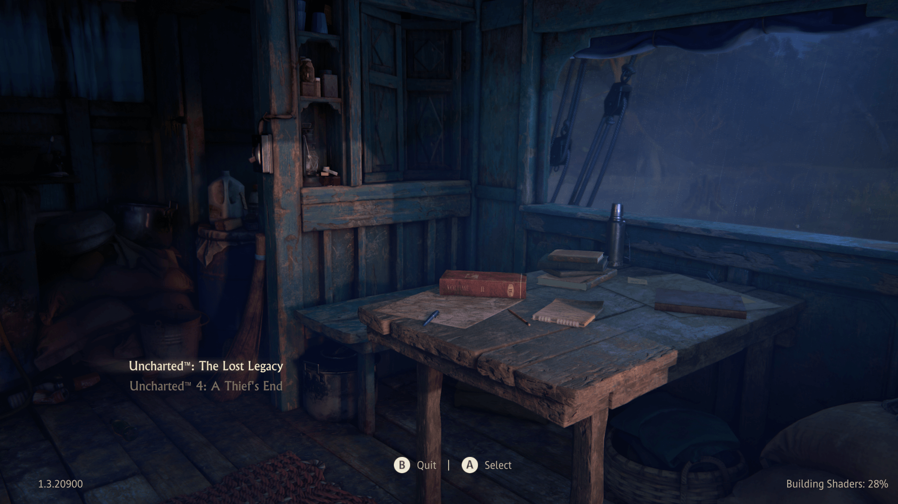

# Uncharted 4 — Main Menu visual reference

**Source:** `uncharted-4-main-menu.png` (Naughty Dog, 2016 / Legacy of Thieves Collection)  
**Added:** 2026-07-16  
**Steve directive:** This is the target art style for MeWorld's game environment. Copy this.

## Reference image

A moodily lit 3D still life: the interior of a wooden shack or ship's cabin during a rainstorm at night. The camera is angled low, looking across a rough-hewn wooden desk toward a large window where rain streaks down the glass. Ropes and canvas sail are visible outside. On the desk: a hand-drawn map, a wooden pencil, a stitched leather journal lying open, a stack of hardcover books, a slim red clothbound volume, and a metal flask. To the left, a tall cabinet painted in chipped, weathered teal-blue holds jars, bottles, and a hanging oil lantern. The rest of the room falls into soft, dark silhouette — sacks, coiled rope, baskets barely visible in shadow.

This is a loading screen — no gameplay, no character. Pure environmental storytelling. The space tells you exactly who works here: a scavenger, a treasure hunter, someone who lives on the water.

---

## Visual style breakdown

### Lighting — cool dominant, warm accent

| Element | Uncharted 4 | MeWorld target |
|---------|-------------|----------------|
| **Dominant cast** | Cool blue-gray — rainy nighttime ambience | Cool clinical overhead on patient, monitor glow |
| **Warm source** | Single warm point off-frame (lantern/lamp) catching wood grain edges, book spine, metal flask | Warm bedside lamp or overhead warm fill |
| **Contrast type** | Warm/cool tension — not all-warm, not all-cool. The cool dominates; warm creates focal points | Same — cool scene, warm accents on patient and key surfaces |
| **Volumetric** | Haze, soft falloff, atmospheric depth — nothing is razor-sharp at distance | Atmospheric haze in deeper ED bay |
| **Ambient occlusion** | Heavy AO in corners, under desk, behind objects — shadows have depth | Deep contact shadows in room corners, under bed |

### Color palette — cool blue-gray with warm accents

| Role | Hex | Where it lives |
|------|-----|----------------|
| Dominant ambient | Cool desaturated blue-gray | Room shadows, distant planes, overall cast |
| Deep shadow | Warm near-black with blue undertone | Deepest corners, silhouettes |
| Wood surface | Weathered brown with cool cast | Desk, cabinet — rich grain, not warm amber |
| Weathered paint | `#5A7A8A` range — chipped teal-blue | Left cabinet, paint detail |
| Warm accent | Amber/gold point light | Lantern glow, edge catch on wood, book spine |
| Red cloth | Muted crimson — `#8B3A3A` range | Book spine — single saturated warm pop |
| Parchment / paper | Cool off-white with blue cast | Map, journal pages |
| Metal | Dull silver / pewter — not brass | Flask, ruler |

**Key insight:** The palette is NOT warm overall. It's a cool, desaturated scene with one warm focal point. That warm/cool tension is what makes it cinematic. If everything were warm it would look flat.

### Composition

| Principle | Application to MeWorld |
|-----------|----------------------|
| **Tabletop still life** | UI elements feel like objects arranged on a desk — not floating digital panels |
| **Depth layering** | Foreground desk objects → midground window/rain → background darkness |
| **Asymmetry** | Objects placed naturally, not centered or gridded |
| **Soft vignette** | Edges fall into deep shadow, framing the desk |
| **Environmental storytelling** | Every object says something about the person who works here |

### Material quality — PBR, high-frequency detail

| Surface | Treatment |
|---------|-----------|
| **Wood grain** | High-res normal/roughness maps — cracks, weathering, uneven surface catching directional light |
| **Weathered paint** | Chipped, worn patina on cabinet — not a flat color, reveals wood underneath |
| **Leather / cloth** | Stitched texture, worn edges, visible grain |
| **Paper** | Deckled edges, slight curl, cool off-white tone |
| **Metal** | Dull pewter/silver — not shiny chrome; subtle reflections |
| **Glass (lantern)** | Warm glow, slight bloom |
| **Fabric (sail/rope)** | Coarse weave barely visible in shadow |

### Atmosphere & mood

- **Not sterile.** This is a working, lived-in space — weathered, worn, authentic. MeWorld should feel like a physician's workspace, not a hospital form.
- **Cool dominant, warm focal.** The room is cool blue-gray; the warm light creates visual hierarchy. Same tension should exist in MeWorld — cool clinical ambient, warm accent on patient and key UI.
- **Depth through atmosphere.** Haze and soft falloff, not everything in crisp focus. Background fades into shadow.
- **Environmental storytelling.** The space itself tells you who works here and what they do. MeWorld equivalent: medical references, case files, instruments visible in the room.
- **Cinematic, not documentary.** Framed like a film still — low angle, depth, atmosphere, not a flat UI.

---

## Current gap analysis

| Aspect | Current MeWorld | Uncharted 4 target |
|--------|-----------------|-------------------|
| **Dominant tone** | Flat near-black `#0A0A0A` — no color temperature at all | Cool blue-gray ambient — shadows have color |
| **Warm/cool tension** | None — just gold on black | Cool dominant + warm focal accents |
| **Background** | Flat dark void | Layered depth — foreground desk, midground window/rain, background shadow |
| **UI materials** | Flat colored rectangles (purple pills) | Objects that feel like real materials — wood, leather, paper, weathered paint |
| **Texture** | None | High-frequency detail everywhere — wood grain, paint chips, fabric weave |
| **Atmosphere** | None — flat CSS | Volumetric haze, soft falloff, vignette |
| **Color accents** | Gold only | Multiple: warm lantern glow, muted crimson, weathered teal, pewter |

---

## How to apply — game elements

### 1. CSS / UI theme

| Token | Current | Target |
|-------|---------|--------|
| `--bg` | `#0A0A0A` (pure near-black) | Cool deep blue-gray — shadows have color |
| `--white` | `#F5F5F5` | Cool off-white — paper in blue ambient |
| `--gold` | `#F0B429` | Keep — warm accent against cool scene |
| `--pill-bg` | `#12063A` (purple) | Deep weathered tone — cool brown or muted navy |
| `--pill-border` | `#6B46C1` (purple) | Muted warm or weathered teal |
| `--muted` | `#888` | Cool grey with blue undertone |
| Panel surfaces | Flat `#0D0D0D`, `#111` | Subtle material feel — not flat rectangles |
| Shadows | `#0A0A0A` / black | Deep with subtle color — not pure black |

### 2. Patient scene (Magnific / ComfyUI generations)

The current scene prompt locks camera angle and layout. Layer in the Uncharted aesthetic:

- **Dominant lighting:** Cool clinical overhead (like the rainy blue ambience) — not warm
- **Warm accent:** Single warm source — bedside lamp, equipment glow — creating focal contrast
- **Atmosphere:** Volumetric haze, soft falloff in deeper bay, vignette at edges
- **Surfaces:** Wood bedside table with visible grain and wear; chipped paint details on cabinets/walls
- **Background:** Dim with depth — not blank void; reference charts, equipment silhouettes in shadow
- **Window:** If visible — night exterior, rain on glass (or equivalent mood)

### 3. medgame.html single-file version

- Replace `--bg: #0A0A0A` with cool deep tone that has color temperature
- Replace purple pills with weathered/material tones
- Add subtle vignette gradient
- Warm gold accent stays — but now reads as warm focal against cool ambient

### 4. React game (`game/`)

- `index.css` theme tokens shift from flat dark to cool atmospheric with warm accents
- Patient scene baseplates regen with cool-dominant + warm-accent lighting spec
- Scene overlay: warm vignette edges fading to cool shadow
- Panel backgrounds: subtle material cues — not flat `#111` rectangles

---

## Approved reference palette

Extracted from the Uncharted 4 main menu:

| Swatch | Hex | Role |
|--------|-----|------|
| Deep cool shadow | `#0F1418` | Background base — near-black with blue undertone |
| Mid cool shadow | `#1A2228` | Panel surfaces, mid shadows |
| Weathered teal | `#4A6A78` | Paint accent — chipped cabinet |
| Rain / glass | `#3A4A58` | Cool midtone — window, atmosphere |
| Wood in cool light | `#2A2822` | Desk surface — brown desaturated by blue ambient |
| Warm focal accent | `#E8C860` | Lantern glow, gold UI highlight |
| Muted crimson | `#8B3A3A` | Saturated warm pop — book spine |
| Parchment in cool light | `#C8C0B8` | Paper — cool off-white |
| Metal / pewter | `#6A6E72` | Flask, ruler — dull silver |
| Deep silhouette | `#080C10` | Darkest shadows — not pure black |

---

## Do not

- Use flat black (`#000000`, `#0A0A0A`) as background — shadows must have color temperature
- Make everything warm — the Uncharted look is COOL dominant with warm accents
- Use purple (`#6B46C1`, `#12063A`) for UI — shift to weathered/material tones
- Make the scene look like a sterile operating room — every surface should feel handled and worn
- Use pure white (`#FFFFFF`) — always cool off-white under blue ambient
- Create a completely flat lighting scheme — always warm/cool tension

---

## Key insight for MeWorld

The Uncharted menu is a **still life, not a UI**. It doesn't feel like you're looking at a software application — it feels like you're standing in a room looking at a real desk. The objects on the desk *are* the menu options. The rain and shadows *are* the background.

For MeWorld, the target is the same: the game shouldn't feel like a web app with dark mode. It should feel like you're standing in a physician's study — case files on the desk, instruments in the cabinet, rain on the window, warm lamp catching the edge of a journal. The clinical tools are the UI.

---

## Related files

| File | Role |
|------|------|
| `dev/screenshots/uncharted-4-main-menu.png` | Primary visual reference |
| `dev/scene-camera-lock/SCENE_LOCK.json` | Patient scene camera + layout spec — add lighting section |
| `medgame.html` | Legacy single-file game — palette lives in `:root` CSS tokens |
| `game/src/index.css` | React game theme tokens |
| `game/public/assets/patient/patient-scene.png` | Male ED baseplate |
| `game/server/casePortrait.js` | Magnific portrait prompt builder |
| `dev/screenshots/ui/ed-map-re4-hud.md` | Existing RE4 HUD reference (companion doc) |
