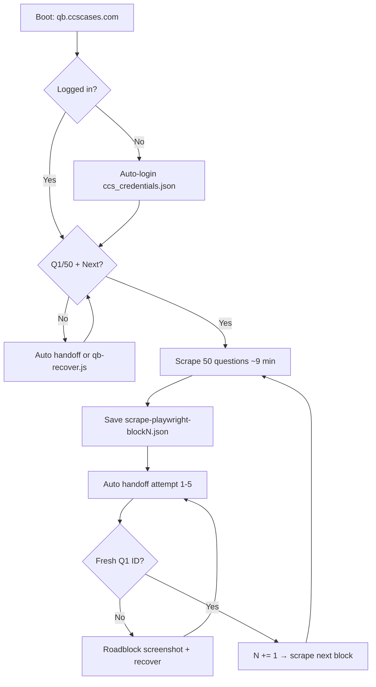

# CCS Question Bank Scraper — Full Workflow

Observed manual process + automated pipeline for scraping 50-question blocks from **qb.ccscases.com** without rate limits, duplicate packs, or broken handoffs.

**Repo:** `C:\Users\steve\MeWorld\step3\`  
**Site:** https://qb.ccscases.com/

---

## What you are building

A continuous scrape of the CCS QB in **50-question blocks**:

- Question text, answers, explanations, vote percentages
- Reveal data (correct answer + community stats)
- Images (from network capture only — no extra API calls)
- One JSON per block → post-processed export with PNG files on disk

Target: hundreds of blocks in one browser session, advancing to a **new** 50-pack each time.

---

## One-time setup

```powershell
cd C:\Users\steve\MeWorld\step3
npm install
npx playwright install chromium
```

Create credentials (gitignored):

```json
// ccs_credentials.json
{ "email": "you@example.com", "password": "..." }
```

First login saves session to `qb_browser_profile/` — **do not delete** this folder between runs.

---

## The manual workflow (what you were doing)

This is the ground-truth sequence observed across blocks 19–29:

```
Login → open test Q1/50
  ↓ scrape 50 questions (Next between each)
  ↓
End Block → Confirm → End Review
  ↓
Create Test → [Practice Mode?] → Begin Test
  ↓
Q1/50 with NEW question ID → scrape next block
```

### Rules learned the hard way

| Do | Don't |
|----|-------|
| **End Block** (stop icon) | **Suspend Block** (pause icon) — opens "Pause Block?" and keeps the same 50-pack |
| **Create Test** for next block | **Resume** — reloads the same questions |
| Wait for **Q1/50** before scraping | Start when only `.next-button` is visible (might be Q23/50) |
| One browser / one scraper | Two scrapers on `qb_browser_profile/` (profile lock) |
| Scroll inside `.testWrapper` | Scroll the browser window edge |

### Handoff timing (observed)

From `handoff-recordings/` median gaps (~2.5s between clicks):

1. End Block  
2. Confirm (test popup — **not** modal-root)  
3. End Review  
4. Create Test  
5. Begin Test (sometimes after Practice Mode click)

Total handoff: **~20–40 seconds** when done correctly.

---

## Automated workflow (recommended)

```powershell
cd C:\Users\steve\MeWorld\step3
npm run scrape:auto
# or explicitly:
node playwright-scrape-qb.js --loop --auto-next --auto-start --start-block N
```

### What each flag does

| Flag | Purpose |
|------|---------|
| `--loop` | Keep browser open; scrape block after block |
| `--auto-next` | Run `handoff-auto.js` between blocks (End Block → Begin Test) |
| `--auto-start` | Don't wait for Enter; start when Q1/50 + Next visible |
| `--start-block N` | Label output `scrape-playwright-blockN.json`; duplicate-check vs block N−1 |
| `--record-clicks` | Save handoff click sequences to `handoff-recordings/` (on by default in loop) |
| `--handoff` | Manual mode: popup + 90s grace for you to click (use if auto fails) |
| `--allow-duplicate` | Override duplicate rejection (debug only) |

### End-to-end loop (mermaid)



---

## Key files

| File | Role |
|------|------|
| `playwright-scrape-qb.js` | Main scraper (v7): loop, duplicate guard, rate-limit backoff |
| `handoff-auto.js` | Replays End Block → Confirm → End Review → Create Test → Begin Test |
| `roadblock-helper.js` | Screenshot + parse page + login + intuitive recovery |
| `qb-recover.js` | Standalone: diagnose stuck state → reach Q1/50 |
| `extract-scrape-images.js` | PNG extract + slim `data-linked.json` |
| `postprocess-batch.js` | Batch post-process (10 files at a time) |
| `handoff-recordings/*.json` | Recorded clicks + timing per block transition |
| `roadblock-screenshots/` | PNG + JSON when handoff/login fails |
| `scrape-playwright-blockN.json` | Raw scrape output per block |
| `scrape-export/` | Post-processed blocks with images on disk |
| `qb_browser_profile/` | Saved login session |
| `ccs_credentials.json` | Auto-login (gitignored) |

---

## Handoff details (automation)

### Correct button targeting

- **End Block:** exact text `End Block` OR `stop-icon` in button image — **never** match `/end block/i` on label (matches "Susp**end Block**")
- **Confirm:** lives in `testPopup` overlay, not `#modal-root` — search page + popup roots
- **Pause Block modal:** if seen, **Cancel** — wrong button was clicked (Suspend)

### Successful recording example (block 28→29)

```
End Block → Confirm → Confirm → End Review → Create Test → Begin Test
Fresh Q1 ID 5303 (was 2414)
Time: 23s
```

Saved as: `handoff-recordings/handoff-block28-to-29.json`

---

## Duplicate protection

Between blocks the scraper:

1. Loads question IDs from block **N−1**
2. After handoff, checks Q1 ID ≠ previous Q1
3. Early-aborts if ≥3 overlapping IDs in first 5 questions
4. Rejects saving if the whole pack overlaps

**Symptom:** blocks 8–10 were 96–100% duplicates of block 7 — caused by **Resume/Suspend** instead of Create Test.

---

## Rate limits (429)

- Images captured via **Playwright network listener only** (no in-page fetch hooks)
- On 429: exponential backoff (15s → 30s → 60s → 120s)
- 3+ hits in one block → abort block

Pace defaults: **~9 minutes per 50 questions** (`--minutes 9`).

---

## When something breaks (roadblocks)

### Agent / operator: read terminal first — don't wait for the user

```powershell
# Check live scraper output (terminal running playwright-scrape-qb.js)
# Look for: Block N done, AUTO HANDOFF, 429, duplicate, ROADBLOCK
```

### Recovery script

```powershell
# Stop scraper first (only one process can use qb_browser_profile/)
Get-Process node | ? { (Get-CimInstance Win32_Process -Filter "ProcessId=$($_.Id)").CommandLine -match 'playwright-scrape-qb' } | Stop-Process -Force

cd C:\Users\steve\MeWorld\step3
node qb-recover.js
# Then restart scraper at current block:
node playwright-scrape-qb.js --loop --auto-next --auto-start --start-block N
```

### Roadblock screenshots

On handoff step failure, saves to `roadblock-screenshots/`:

- `{timestamp}_{tag}.png` — full page
- `{timestamp}_{tag}.json` — URL, buttons, overlays, Q position

**Parse the JSON** to decide next action (login, Confirm, Cancel Pause, Create Test, etc.).

### Common stuck states → fix

| Screen | Action |
|--------|--------|
| Login page | Auto-login via `ccs_credentials.json` |
| "Pause Block?" + Attempt Name | **Cancel** — never Confirm Suspend |
| End Block confirm popup | Click **Confirm** (testPopup) |
| Review / 1/0 | End Review → Create Test → Begin Test |
| `/createtest` | Create Test → Begin Test |
| Same Q1 ID after handoff | End Block the old pack; do not Resume |

---

## Post-processing (after scrape)

Run **while scraper is working** — does not touch the browser.

```powershell
cd C:\Users\steve\MeWorld\step3

# All batches
node postprocess-batch.js --all --dir "C:\Users\steve\MeWorld\step3"

# Or one batch at a time (10 files, newest first)
node postprocess-batch.js --batch 1
node postprocess-batch.js --batch 2
node postprocess-batch.js --batch 3

# Single file
node extract-scrape-images.js scrape-playwright-block28.json
```

Output:

```
scrape-export/scrape-playwright-block28/
  data-linked.json    ← slim JSON, relative image paths
  images/q01/...
  README.md
```

See also: `POSTPROCESS-AGENT.md` for agent handoff on batch runs.

---

## Manual handoff mode (fallback)

If `--auto-next` fails repeatedly:

```powershell
node playwright-scrape-qb.js --loop --handoff --record-clicks --auto-start --start-block N
```

1. Scraper finishes block → blue popup appears  
2. You have **90s** after closing popup (`--handoff-grace-ms 90000`)  
3. Click: End Block → Confirm → End Review → Create Test → Begin Test  
4. Clicks are recorded to `handoff-recordings/` for improving auto handoff  

---

## Monitoring checklist (autonomous)

Read terminal; act without user input:

1. **Scraping:** lines like `Q15/50 Next… ✓` — leave it alone  
2. **Block done:** `Block N done — 50/50 reveals` — expect auto handoff in 3s  
3. **Handoff OK:** `Fresh Q1 ID …` then `===== BLOCK N+1 =====`  
4. **Handoff fail:** `AUTO HANDOFF attempt 2/5` — watch for Confirm/End Review; check `roadblock-screenshots/`  
5. **Duplicate:** `Q1 unchanged` — recovery must End Block, not Resume  
6. **429:** backoff messages — do not restart unless aborted  
7. **Post-process:** run batches for any new `scrape-playwright-blockN.json` after block saves  

---

## Progress snapshot (Jul 2026)

| Blocks | Status |
|--------|--------|
| 1 (`scrape-playwright-output.json`) | Scraped + exported |
| 2–25 | Scraped + exported |
| 26 | Scraped but **13/50 reveals** — re-scrape later |
| 27–29 | 50/50 reveals; 29 in progress when doc written |
| 8–10 | **Bad duplicates** of block 7 — delete/ignore |

Handoff recordings: blocks 19→20 through 28→29 in `handoff-recordings/`.

---

## npm scripts (package.json)

```json
"scrape":       "node playwright-scrape-qb.js",
"scrape:loop":  "node playwright-scrape-qb.js --loop --handoff --record-clicks --auto-start --start-block 6",
"scrape:auto":  "node playwright-scrape-qb.js --loop --auto-next --auto-start --start-block 27",
"postprocess":  "node postprocess-batch.js --batch 1 --batch-size 10",
"postprocess:all": "node postprocess-batch.js --all --batch-size 10",
"extract-images": "node extract-scrape-images.js"
```

Update `--start-block` to current block when resuming.

---

## Do NOT commit

- `ccs_credentials.json`
- `qb_browser_profile/`
- Raw scrape JSON if it contains session tokens (usually safe, but keep repo lean)
- `roadblock-screenshots/` (debug artifacts)

---

## Quick reference commands

```powershell
cd C:\Users\steve\MeWorld\step3

# Production loop (auto handoff)
node playwright-scrape-qb.js --loop --auto-next --auto-start --start-block 29

# Recover stuck browser
node qb-recover.js

# Login only (save session)
node playwright-scrape-qb.js --login-only

# Post-process everything
node postprocess-batch.js --all --dir "C:\Users\steve\MeWorld\step3"

# Kill stray scrapers
Get-Process node | ForEach-Object { $c=(Get-CimInstance Win32_Process -Filter "ProcessId=$($_.Id)").CommandLine; if($c -match 'playwright-scrape-qb'){Stop-Process $_.Id -Force} }
```
